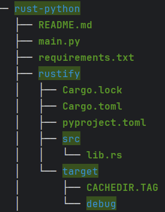

# Python Package with Rust

## Starting Project

### Start New Python Project

Start new python virtual environment with any provider like virtualenv, pipenv, poetry or anaconda.

### Install Maturin

```shell
pip install maturin
```

### Start Rust Project

Select `pyo3` for bindings when prompt comes.

```shell
maturin new <project_name>
```

### Folder Structure



### Compile Project

```shell
maturin develop
```

### Import Rust Function in Python

```python
from rustify import sum_as_string


if __name__ == '__main__':
    print(sum_as_string(5, 15))
```
